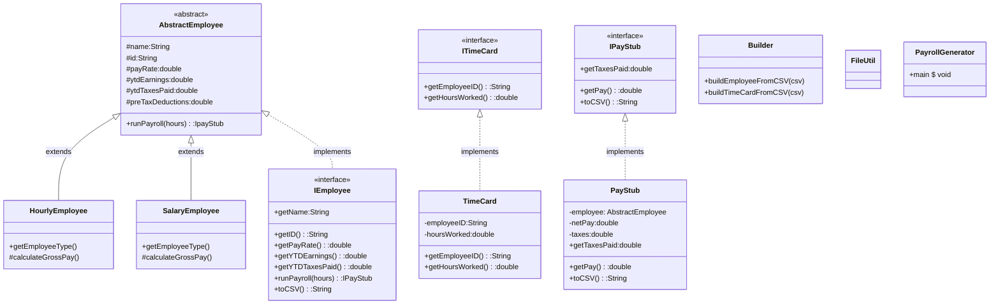
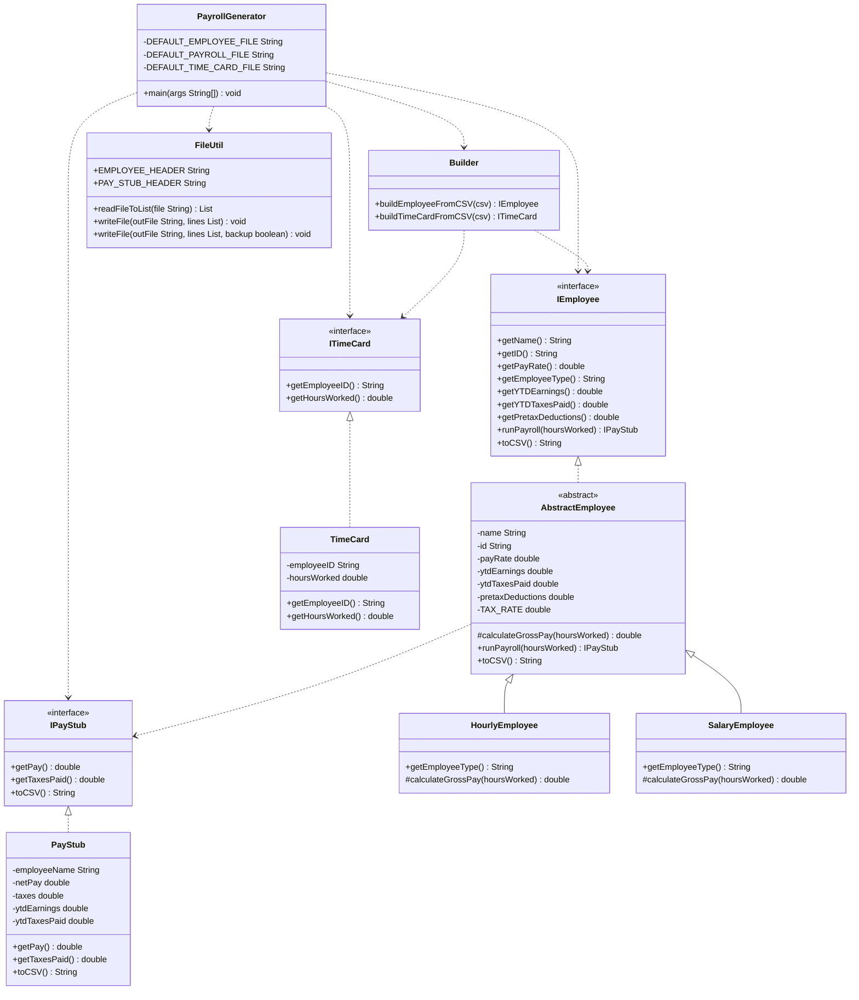

# Payroll Generator Design Document

This document is meant to provide a tool for you to demonstrate the design process. You need to work on this before you code, and after have a finished product. That way you can compare the changes, and changes in design are normal as you work through a project. It is contrary to popular belief, but we are not perfect our first attempt. We need to iterate on our designs to make them better. This document is a tool to help you do that.

If you are using mermaid markup to generate your class diagrams, you may edit this document in the sections below to insert your markup to generate each diagram. Otherwise, you may simply include the images for each diagram requested below in your zipped submission (be sure to name each diagram image clearly in this case!)

## (INITIAL DESIGN): Class Diagram

Include a UML class diagram of your initial design for this assignment. If you are using the mermaid markdown, you may include the code for it here. For a reminder on the mermaid syntax, you may go [here](https://mermaid.js.org/syntax/classDiagram.html)

## (INITIAL DESIGN): Tests to Write - Brainstorm

Write a test (in english) that you can picture for the class diagram you have created. This is the brainstorming stage in the TDD process. 

> [!TIP]
> As a reminder, this is the TDD process we are following:
> 1. Figure out a number of tests by brainstorming (this step)
> 2. Write **one** test
> 3. Write **just enough** code to make that test pass
> 4. Refactor/update  as you go along
> 5. Repeat steps 2-4 until you have all the tests passing/fully built program

You should feel free to number your brainstorm. 

1. Test that the `Employee` class properly returns `name` from `getName()`
2. Test that the `Employee` class properly returns `id` from `getId()`
3. continue to add your brainstorm here (you don't need to super formal - this is a brainstorm) - yes, you can change the bullets above to something that fits your design.

## (FINAL DESIGN): Class Diagram

Go through your completed code, and update your class diagram to reflect the final design. We want both the diagram for your initial and final design, so you may include another image or include the finalized mermaid markup below. It is normal that the two diagrams don't match! Rarely (though possible) is your initial design perfect. 

> [!WARNING]
> If you resubmit your assignment for manual grading, this is a section that often needs updating. You should double check with every resubmit to make sure it is up to date.

## (FINAL DESIGN): Reflection/Retrospective

> [!IMPORTANT]
> The value of reflective writing has been highly researched and documented within computer science, from learning new information to showing higher salaries in the workplace. For this next part, we encourage you to take time, and truly focus on your retrospective.

Take time to reflect on how your design has changed. Write in *prose* (i.e. do not bullet point your answers - it matters in how our brain processes the information). Make sure to include what were some major changes, and why you made them. What did you learn from this process? What would you do differently next time? What was the most challenging part of this process? For most students, it will be a paragraph or two.

During the initial design phase, my focus was mainly on identifying the methods required by the three interfaces, and what fields and methods each abstract/concrete class needed. I also thought about how each class contributed to the pay calculation formula. AbstractEmployee handles the payroll logic, TimeCard provides the hours worked, and PayStub stores the result.

The overall structure of the 3 interfaces and 5 abstract/concrete classes was relatively close to the final one. The main changes were that PayStub was updated to store individual fields instead of an AbstractEmployee reference. It’s easier to build the constructor with already calculated values. calculateGrossPay() was added separately from runPayroll() to handle the gross pay logic.

In the final design, I added more detail to Builder and PayrollGenerator as I only fully understood
their relationships with other classes after writing all the code. The most challenging part for me was building a image of the entire program flow before writing any code. It required repeatedly reading and reviewing the provided files to understand how everything connected together. If I were to do this again, I would start by tracing through main() to clarify the overall flow, and make sure to specify the return type of every method during the design phase.
